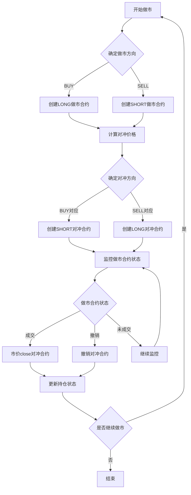

# 永续合约自动对冲策略
## 一、在同一个交易所进行合约对冲
### 方法：
每做市一个合约，同时铺一个反向等值对冲合约。对冲合约的价格将两次交易的手续费考虑在内。撤销做市合约时，同时撤销对冲合约。做市合约如果成交，市价close对冲合约。  
### 要求：
使用双向持仓模式，手续费加倍。
### 价格定义：
**maker_price:** 做市价格，由做市程序计算。  
**delta_price:** 做市差价，delta_price = maker_price - ticker_price   
**hedge_price:** 对冲价格，hedge_price = ticker_price - delta_price  
**positioon_side:** "LONG" if price>ticker_price else "SHORT"  
**trade_fee:** 单次手续费，trade_fee = amount * fee_rate  
### 考虑手续费：
**if hedge_position_side = "LONG":** hedge_price += trade_fee * 2  
**if hedge_position_side = "SHORT":** hedge_price -= trade_fee * 2
### 不足:
**1.** 市价close对冲合约时，可能因为滑点导致亏损，有风险。滑点控制方法：需调研。  
**2.** 最高两倍的交易费用，占用两倍的保证金，成本高。
**3.** 做市和对冲在一个交易所内，承受平台风险。

### 流程图：

## 二、在不同交易所进行合约对冲
### 方法：
在A交易所每做市一个合约，同时在B交易所铺一个反向等值对冲合约。对冲合约的价格将两次交易手续费考虑在内。撤销做市合约时，同时撤销对冲合约。做市合约如果成交，市价close对冲合约。  
### 要求：
A、B两个账户都可以是单向持仓账户。  
疑问：作为做市商，单向持仓账户能满足要求吗？
### 方法：
基本与在同一个交易所内进行合约对冲相同，只是fee的计算要考虑两个交易所。
### 优缺点：
**1.** 只有A交易所能拿到做市商费率，B交易所费率可能较高。成本高。
**2.** A、B交易所实时价格 ticker_price 有差异，可能造成亏损，也可能有收益。
**3.** 两个单向持仓账户，合约抵消，占用保证金减少。
**4.** 降低单个交易所的平台风险。
## 三、在同一个交易所进行现货对冲
### 方法：
**1.** 每铺一个LONG合约，卖出等值现货。当LONG合约成交或者撤销，则买入等值现货。
**2.** 每铺一个SHORT合约，买入等值现货。当SHORT合约成交或者撤销，则卖出等值线回现货。
**3.** 在允许的时间窗口内，现货的买入和卖出交易聚合，以减少现货交易量。
### 优缺点：
**1.** 现货交易聚合，如何LONG、SHORT金额相近，所需资金比较少。
**2.** 如果LONG、SHORT金额不均衡，所需资金会比较大 = leverage * delta_amount。
**3.** 现货和合约的市场价格如果发生背离，算法可能比较复杂，得失还没想清楚。
**3.** 对单一交易所平台的依赖风险。
## 四、在不同交易所进行现货对冲
### 方法：
A交易所做市合约，B交易所交易现货进行对冲。与上一种策略类似。  
### 优缺点：
与上一种策略不同的地方是：  
**1.** 交易所，产品不同，价格背离更高，复杂度更高
**2.** 降低单个交易所的平台风险
## 总结：

## 五、不同策略对比表格

| 策略 | 操作方式 | 手续费 | 保证金占用 | 平台风险 | 价格风险 | 复杂度 | 适用场景 |
|------|---------|--------|------------|----------|----------|--------|----------|
| 同一交易所合约对冲 | 双向持仓，反向合约 | 较高（两倍） | 较高（两倍） | 高 | 低 | 低 | 对平台信任度高，追求简单操作 |
| 不同交易所合约对冲 | 单向持仓，跨交易所反向合约 | 中等（两交易所） | 中等（单向持仓） | 低 | 中等（价格差异） | 中等 | 降低平台风险，对价格差异有容忍度 |
| 同一交易所现货对冲 | 合约与现货反向操作 | 低（现货交易可聚合） | 视LONG/SHORT平衡度而定 | 高 | 中等（现货与合约价格背离） | 高 | 资金有限，能处理现货合约价格背离 |
| 不同交易所现货对冲 | 跨交易所现货与合约反向操作 | 低（现货交易可聚合） | 视LONG/SHORT平衡度而定 | 低 | 高（跨交易所价格差异） | 很高 | 追求最低平台风险，能处理复杂价格差异 |
